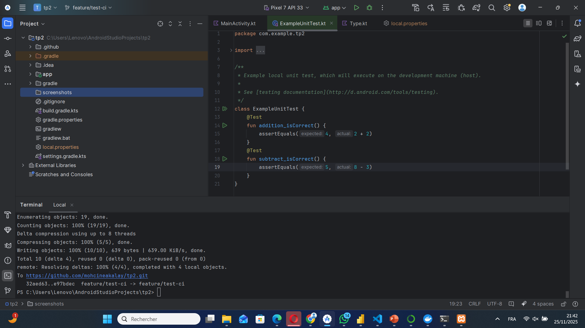
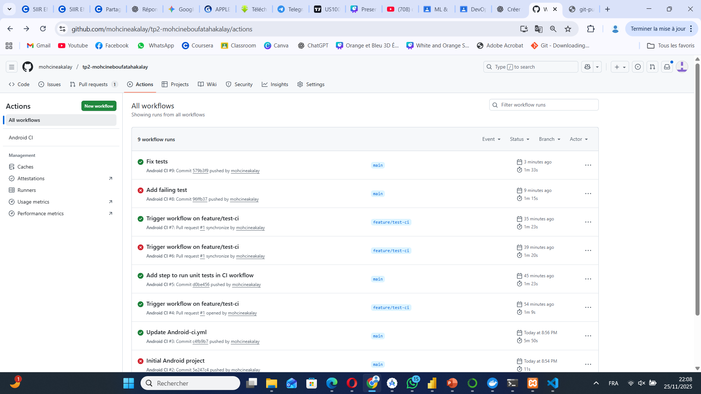

# TP2 

## Description du projet
Ce projet est une **application Android de démonstration** pour le TP2.  
L’objectif principal est de mettre en place un **workflow GitHub Actions** qui compile l’application et exécute les tests unitaires automatiquement à chaque push ou pull request.

---

## Fonctionnalités
- Projet Android simple avec Kotlin
- Tests unitaires pour vérifier les fonctions de base
- Workflow CI/CD avec GitHub Actions

---

## Structure du workflow GitHub Actions
Le workflow est défini dans `.github/workflows/android-ci.yml` et effectue les étapes suivantes :

1. Checkout du code source
2. Installation du **JDK 17**
3. Permission pour exécuter `gradlew`
4. Build du projet avec Gradle
5. Exécution des tests unitaires (`./gradlew :app:testDebugUnitTest`)

**Workflow déclenché sur :**
- Push sur les branches `main` ou `feature/test-ci`
- Pull request vers la branche `main` ou `feature/test-ci`

---

## Captures d'écran

### Application Android


### Tests unitaires (workflow GitHub Actions)


---

## Tests unitaires
Exemple de tests présents dans `ExampleUnitTest.kt` :

```kotlin
@Test
fun addition_isCorrect() {
    assertEquals(4, 2 + 2)
}

@Test
fun subtract_isCorrect() {
    assertEquals(5, 8 - 3)
}
